# 📊 DIAGRAMAS DE COMUNICACIÓN UML 2.5+

Este documento contiene los diagramas de comunicación que describen la interacción dinámica entre los objetos del sistema BPM, cumpliendo con el estándar UML 2.5+.

---

## CU-01: Gestionar Organización y Departamentos
**Escenario:** Registro de una nueva Organización (Tenant) en el sistema.

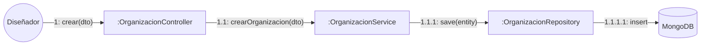

**Descripción de Mensajes:**
1. **crear(dto)**: El Diseñador envía los datos de la organización a través de la interfaz web (Angular) al controlador REST.
2. **crearOrganizacion(dto)**: El controlador delega la lógica de negocio al servicio especializado.
3. **save(entity)**: El servicio mapea el DTO a una Entidad y solicita su persistencia al repositorio.
4. **insert**: El framework Spring Data MongoDB ejecuta la operación de inserción en la base de datos NoSQL.

---

## CU-02: Gestionar Usuarios y Roles
**Escenario:** Registro de un nuevo Funcionario dentro de una Organización.

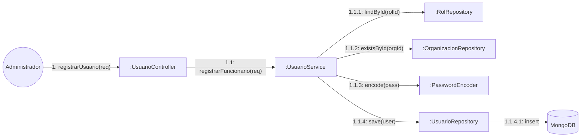

**Descripción de Mensajes:**
1. **registrarUsuario**: Recepción de solicitud REST con datos del funcionario y credenciales.
2. **registrarFuncionario**: Orquestación del proceso de validación y persistencia.
3. **findById / existsById**: Verificación de integridad referencial (el rol y la organización deben existir).
4. **encode**: Encriptación de la contraseña mediante BCrypt antes de persistir.
5. **save**: Persistencia del objeto de dominio transformado en Entidad.

---

## CU-03: Autenticar Usuario (Login JWT)
**Escenario:** Inicio de sesión exitoso y generación de Token.

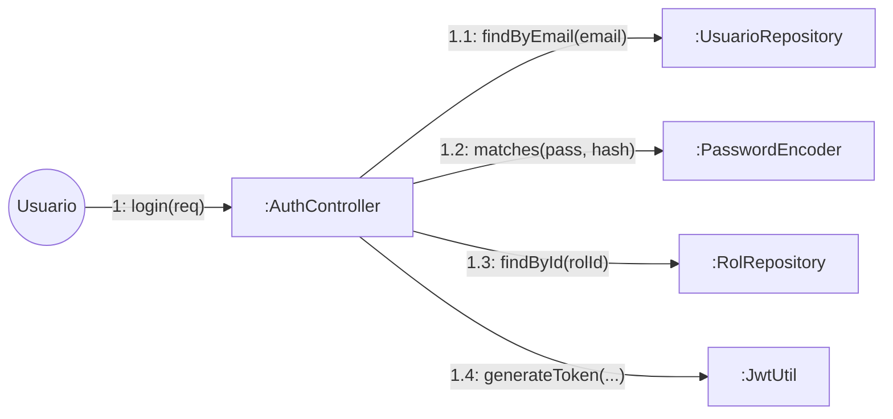

**Descripción de Mensajes:**
1. **login**: Envío de credenciales (email/password).
2. **findByEmail**: Recuperación del usuario desde la base de datos.
3. **matches**: Validación de la contraseña enviada contra el hash almacenado.
4. **findById**: Obtención del nombre del rol para incluirlo en los claims del token.
5. **generateToken**: Generación del string JWT firmado para sesiones posteriores.

---

## CU-17: Gestionar Privilegios / Jefaturas
**Escenario:** Asignación de un Jefe a un Departamento (Jerarquía).

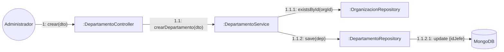

**Descripción de Mensajes:**
1. **crear**: Solicitud de creación o actualización de departamento con `idJefe`.
2. **crearDepartamento**: Validación de pertenencia a la organización.
3. **existsById**: Validación del Tenant.
4. **save**: Persistencia del departamento incluyendo la referencia al usuario jefe (CU-17).

---

## CU-22: Exportación de Reportes
**Escenario:** Generación y descarga de reporte de métricas en formato Excel.

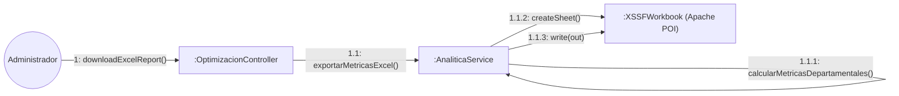

**Descripción de Mensajes:**
1. **downloadExcelReport**: Solicitud del usuario para obtener el estado actual de los departamentos.
2. **exportarMetricasExcel**: El servicio inicia la construcción del binario del reporte.
3. **calcularMetricasDepartamentales**: Recolección de datos agregados (trámites, tiempos, personal).
4. **createSheet / write**: Uso de la librería Apache POI para estructurar las celdas y escribir el flujo de bytes.

---

## CU-04: Gestionar Políticas Básicas
**Escenario:** Diseño y guardado de un nuevo Flujo de Trabajo (Workflow).

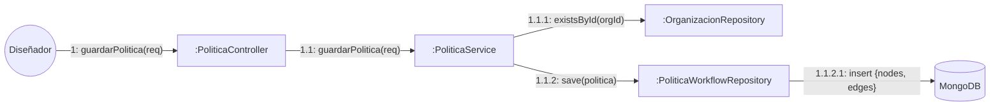

**Descripción de Mensajes:**
1. **guardarPolitica**: Recepción del JSON estructurado con nodos y aristas del diagrama.
2. **guardarPolitica (Service)**: Validación de reglas de negocio y SLAs.
3. **existsById**: Verificación de seguridad del Tenant.
4. **save**: Persistencia del documento JSON en MongoDB.

---

## CU-05: Diseñar Flujo Interactivo
**Escenario:** Sincronización en tiempo real del diseño entre múltiples administradores.

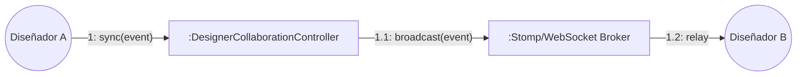

**Descripción de Mensajes:**
1. **sync**: El Diseñador A mueve un nodo en el lienzo; el evento se envía vía WebSocket.
2. **broadcast**: El controlador recibe el mensaje y lo redirige al tópico de suscripción.
3. **relay**: El broker de mensajería entrega el evento a todos los diseñadores conectados al mismo flujo.

---

## CU-06: Construir Formulario Dinámico
**Escenario:** Asociación de campos de entrada (inputs) a una actividad del flujo.

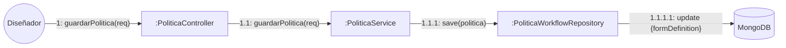

**Descripción de Mensajes:**
1. **guardarPolitica**: El request incluye la lista de `FormFieldDefinition` (labels, types, validations).
2. **save**: El motor persiste la configuración del formulario dentro del objeto embebido del nodo.

---

## CU-18: Ciclo de Vida y Versionado
**Escenario:** Publicación de una nueva versión de política y archivado de la anterior.

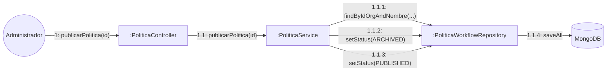

**Descripción de Mensajes:**
1. **publicarPolitica**: Petición para activar una versión `DRAFT`.
2. **findByIdOrgAndNombre**: Localización de versiones previas de la misma política.
3. **setStatus(ARCHIVED)**: Desactivación de la versión actualmente publicada.
4. **setStatus(PUBLISHED)**: Activación de la nueva versión.

---

## CU-19: Configurar SLAs y Alertas
**Escenario:** Definición de tiempos límite de atención por nodo.

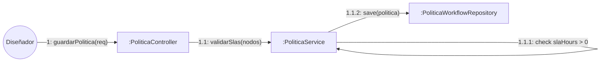

**Descripción de Mensajes:**
1. **validarSlas**: Antes de guardar, el servicio verifica que cada `USER_TASK` tenga un tiempo asignado.
2. **save**: Persistencia de los atributos `slaHours` en cada nodo del documento.

---

## CU-07: Iniciar Nuevo Trámite
**Escenario:** Creación de una instancia de proceso por un cliente o funcionario.

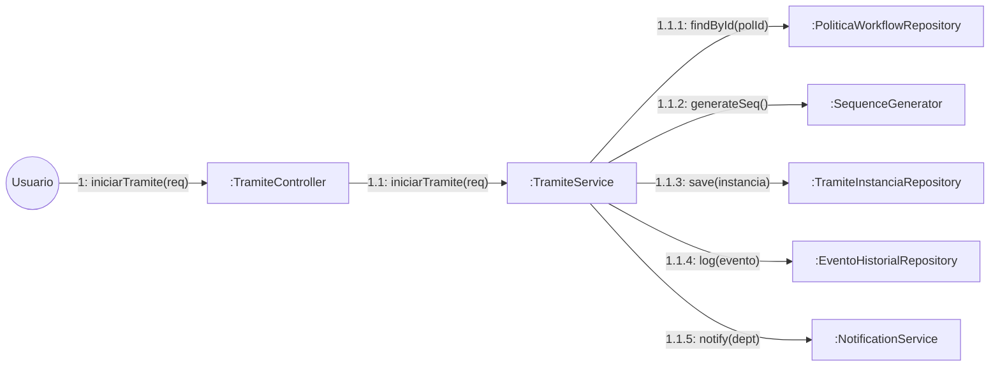

**Descripción de Mensajes:**
1. **iniciarTramite**: El usuario selecciona una política publicada y envía los datos iniciales.
2. **generateSeq**: Generación del código correlativo único (ej. TRM-2026-0001).
3. **save**: Creación del documento en MongoDB con el estado inicial `EN_PROGRESO` y posicionamiento en el primer nodo `USER_TASK`.
4. **log**: Registro en la bitácora histórica (CU-10).
5. **notify**: Envío de alerta al departamento encargado del primer nodo.

---

## CU-08: Visualizar Bandejas
**Escenario:** El funcionario consulta sus tareas asignadas.

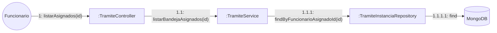

**Descripción de Mensajes:**
1. **listarAsignados**: Consulta de la lista de trámites donde el funcionario es el responsable actual.
2. **findByFuncionarioAsignadoId**: Filtrado en la base de datos por el ID del usuario en sesión.

---

## CU-09: Atender y Avanzar Trámite
**Escenario:** El funcionario completa una tarea y el sistema resuelve el siguiente nodo.

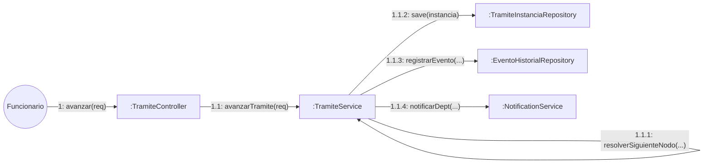

**Descripción de Mensajes:**
1. **avanzar**: Envío de datos del formulario y decisión de avance.
2. **resolverSiguienteNodo**: El motor evalúa el grafo y las condiciones (Gateways) para determinar el destino.
3. **save**: Actualización del nodo actual, departamento y fechas de SLA.
4. **registrarEvento**: Almacenamiento del snapshot de datos en la bitácora.

---

## CU-10: Consultar Historial
**Escenario:** Consulta de la trazabilidad completa de un trámite.

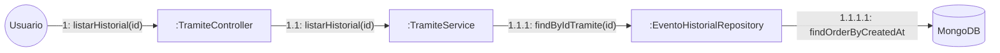

**Descripción de Mensajes:**
1. **listarHistorial**: Solicitud de la línea de tiempo de eventos de un trámite específico.
2. **findByIdTramite**: Recuperación de todos los registros de la bitácora ordenados cronológicamente.

---

## CU-20: Supervisión de Jefatura
**Escenario:** El jefe de área visualiza todos los trámites pendientes de su departamento.

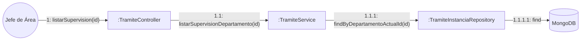

**Descripción de Mensajes:**
1. **listarSupervision**: Vista extendida que permite monitorear la carga de trabajo del personal a cargo.
2. **findByDepartamentoActualId**: Recuperación de instancias filtradas por la unidad organizacional del jefe.

---

## CU-21: Intervención y Reasignación Administrativa
**Escenario:** Cambio forzado de un trámite a otro nodo o departamento por parte de un administrador.

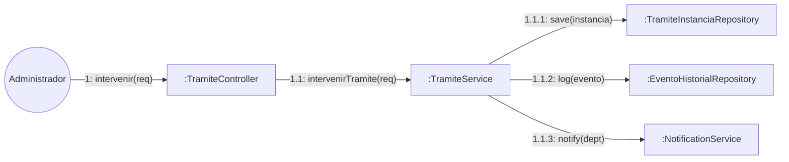

**Descripción de Mensajes:**
1. **intervenir**: Salto excepcional de la lógica del flujo para destrabar procesos.
2. **save**: Actualización manual del `nodoActualId` y `departamentoActualId`.
3. **log**: Registro de la intervención con el motivo especificado por el administrador.

---

## CU-11: Gestionar Archivos (GridFS)
**Escenario:** Subida de evidencias documentales asociadas a un trámite.

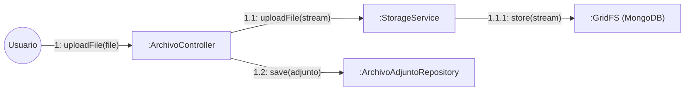

**Descripción de Mensajes:**
1. **uploadFile (Controller)**: Recepción del archivo multipart.
2. **uploadFile (Storage)**: Transmisión del flujo de bytes hacia el sistema de archivos distribuido de MongoDB.
3. **store**: Fragmentación y almacenamiento del binario en GridFS.
4. **save**: Persistencia de los metadatos (nombre, tipo, gridFsId) en una colección de referencia.

---

## CU-12: Notificaciones Push/WS
**Escenario:** El sistema alerta a un funcionario sobre una nueva tarea en tiempo real.

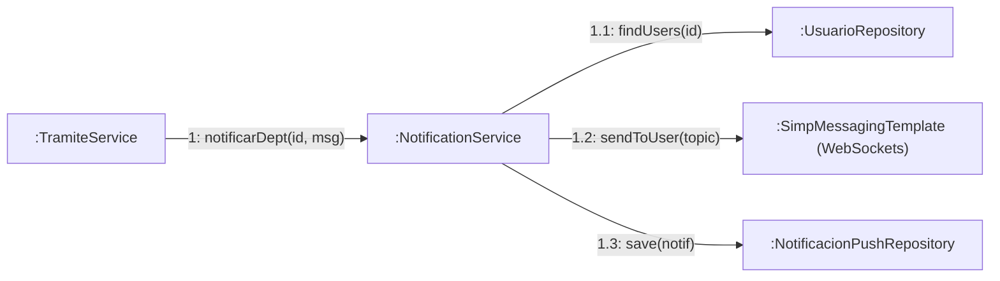

**Descripción de Mensajes:**
1. **notificarDept**: Disparo automático tras un cambio de estado en el workflow.
2. **sendToUser**: Envío asíncrono del mensaje a través del canal de WebSockets abierto en el navegador del usuario.
3. **save**: Almacenamiento persistente de la notificación para consulta histórica en la bandeja de notificaciones.

---

## CU-13: Consultar Auditoría
**Escenario:** El administrador revisa el log de operaciones críticas del sistema.

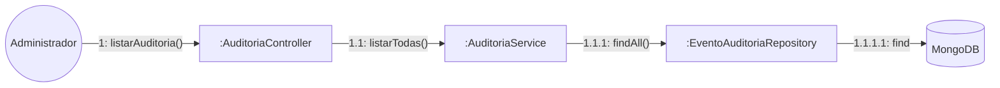

**Descripción de Mensajes:**
1. **listarAuditoria**: Consulta de eventos técnicos (login, borrado de registros, accesos denegados).
2. **AuditoriaService**: Recuperación de logs generados automáticamente mediante AOP (Aspect Oriented Programming).

---

## CU-14: Generar Flujo con IA (NLP)
**Escenario:** Creación de un proceso a partir de una descripción textual (Prompt).

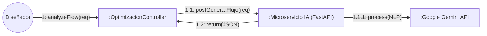

**Descripción de Mensajes:**
1. **analyzeFlow**: El diseñador envía un texto (ej: "Proceso para solicitud de vacaciones").
2. **postGenerarFlujo**: El backend retransmite la petición al microservicio en Python.
3. **Gemini**: La IA procesa el lenguaje natural y devuelve una estructura JSON compatible con el diseñador.

---

## CU-15: Dashboard y Cuellos de Botella
**Escenario:** Análisis proactivo del rendimiento institucional mediante IA.

```mermaid
graph LR
    Actor((Administrador)) -- "1: analyzeBottlenecks()" --> Controller[":OptimizacionController"]
    Controller -- "1.1: calcularMetricas()" --> Service[":AnaliticaService"]
    Controller -- "1.2: postAnalizar(metrics)" --> IA[":Microservicio IA (FastAPI)"]
    IA -- "1.3: return(Insights)" --> Controller
```

**Descripción de Mensajes:**
1. **analyzeBottlenecks**: Solicitud de análisis de tiempos y retrasos.
2. **calcularMetricas**: El backend agrega datos de trámites reales desde la BD.
3. **postAnalizar**: Se envían las métricas crudas a la IA para identificar cuellos de botella y recomendaciones.

---

## CU-16: Asistente de Voz
**Escenario:** Interacción del usuario con el asistente virtual para consultas rápidas.

```mermaid
graph LR
    Actor((Usuario)) -- "1: chatAssistant(msg)" --> Controller[":OptimizacionController"]
    Controller -- "1.1: postChat(msg)" --> IA[":Microservicio IA (FastAPI)"]
    IA -- "1.1.1: TTS/STT" --> Gemini[":Google Gemini API"]
    IA -- "1.2: return(Voz/Texto)" --> Controller
```

**Descripción de Mensajes:**
1. **chatAssistant**: El usuario envía un comando de voz o texto.
2. **postChat**: El backend gestiona el contexto de seguridad y envía el mensaje a la IA.
3. **Gemini**: Generación de respuesta inteligente y síntesis de voz (ElevenLabs en microservicio).
