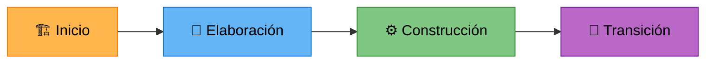

<p align="center">
  
  
  
  
  
</p>

# 🏛️ BPM Workflow System — Sistema de Gestión de Procesos de Negocio

Sistema empresarial de automatización de flujos de trabajo (BPM) con inteligencia artificial integrada. Construido bajo la metodología **PUDS (Proceso Unificado de Desarrollo de Software)** y una arquitectura estricta de **4 capas**.

## 🏗️ Estructura del Proyecto

```text
/bpm-workflow-system
├── /backend_bpm        # Spring Boot 4.0.5 REST API
│   ├── /app            # 🔵 Capa Aplicación (Controllers, DTOs, Security, Config)
│   ├── /domain         # 🟢 Capa Dominio (Services, Lógica, Validaciones)
│   └── /data           # 🔴 Capa Datos (Entities, MongoDB Repositories)
│
├── /frontend-bpm       # Angular 20 SPA
│   └── /src/app
│       ├── /presentation # 🔵 Capa Presentación (Componentes UI por modulo)
│       └── /data         # 🟡 Capa Datos Frontend (Services HTTP, Models)
│
├── /ia_microservice    # 🤖 FastAPI / IA
│   └── main.py         # Endpoints de IA (Python)
│
└── docker-compose.yml  # Configuración MongoDB
```

## 🔄 Metodología PUDS (Proceso Unificado de Desarrollo de Software)

El desarrollo sigue las fases iterativas e incrementales del PUDS:



| Fase PUDS | Ciclo del Proyecto | Estado |
|---|---|---|
| **Inicio + Elaboración** | Ciclo 1: Cimientos y Seguridad | ✅ Completado |
| **Elaboración + Construcción** | Ciclo 2: Motor Core y Builders | ⚠️ Pendiente |
| **Construcción** | Ciclo 3: Operación y Tiempo Real | ⚠️ Pendiente |
| **Transición** | Ciclo 4: IA y Optimización | ⚠️ Pendiente |

### Artefactos PUDS Generados

- 📋 [Plan Operativo de Desarrollo](./PLAN_OPERATIVO_DE_DESARROLLO.md) — Roadmap completo de casos de uso
- 🧪 [Plan de Pruebas](./PLAN_PRUEBAS.md) — Pruebas unitarias, integración y verificación full-stack
- 📐 [Plan de Desarrollo Central](./PLAN_DESARROLLO_CENTRAL.md) — Visión arquitectónica del sistema

---

## 📁 Estructura del Monorepo

```
bpm-workflow-system/
│
├── 📂 backend_bpm/              ← Spring Boot 4.0.5 (API REST + Seguridad)
│   ├── src/main/java/com/bpm/
│   │   ├── app/                 ← Capa de Aplicación
│   │   ├── domain/              ← Capa de Dominio
│   │   └── data/                ← Capa de Datos
│   ├── src/test/                ← Tests unitarios (JUnit 6 + Mockito)
│   └── README.md                ← Guía del backend
│
├── 📂 frontend-bpm/             ← Angular 20 (SPA)
│   ├── src/app/
│   │   ├── presentation/        ← Capa de Presentación (Componentes UI)
│   │   └── data/                ← Servicios, Modelos, Interceptors
│   └── README.md                ← Guía del frontend
│
├── 📂 ia_microservice/          ← FastAPI (Python) — Microservicio IA
│   ├── main.py
│   └── requirements.txt
│
├── 📂 MOBILE/                   ← Flutter (Futuro)
│
├── 🐳 docker-compose.yml       ← MongoDB containerizado
├── 📋 PLAN_OPERATIVO_DE_DESARROLLO.md
├── 🧪 PLAN_PRUEBAS.md
├── 📐 PLAN_DESARROLLO_CENTRAL.md
└── 📖 README.md                 ← (Este archivo)
```

---

## 🚀 Guía Rápida de Inicio

### Prerrequisitos

| Herramienta | Versión Mínima |
|---|---|
| Java JDK | 17+ |
| Node.js | 20+ |
| Docker + Docker Compose | 24+ |
| Python | 3.11+ |
| Angular CLI | 20+ |

### 1. Levantar la Base de Datos

```bash
docker compose up -d
```
> Esto inicia MongoDB en `localhost:27017` con la base `bpm_workflow`.

### 2. Levantar el Backend

```bash
cd backend_bpm
./mvnw spring-boot:run
```
> API disponible en `http://localhost:8080`

### 3. Levantar el Frontend

```bash
cd frontend-bpm
npm install
ng serve
```
> Aplicación disponible en `http://localhost:4200`

### 4. Levantar el Microservicio IA (Opcional)

```bash
cd ia_microservice
pip install -r requirements.txt
uvicorn main:app --reload --port 8000
```

---

## 🔐 Seguridad del Sistema

El sistema implementa un esquema de seguridad basado en **JWT (JSON Web Tokens)** con las siguientes características:

- **Autenticación Stateless** — Sin sesiones del lado del servidor
- **Encriptación BCrypt** — Passwords almacenados como hash irreversible
- **Interceptor Angular** — Token JWT inyectado automáticamente en cada petición
- **Protección Anti Cross-Tenant** — Validación de integridad multitenant
- **Auditoría AOP** — Registro automático de toda operación de negocio

---

## 📂 Navegación Rápida

| Módulo | Descripción | Enlace |
|---|---|---|
| 🖥️ **Backend** | API REST con Spring Boot, JWT y MongoDB | [→ Ver README del Backend](./backend_bpm/README.md) |
| 🌐 **Frontend** | Aplicación Angular con módulos por feature | [→ Ver README del Frontend](./frontend-bpm/README.md) |
| 🤖 **Microservicio IA** | Motor de NLP y analítica con FastAPI | [→ Ver carpeta IA](./ia_microservice/) |
| 📋 **Plan Operativo** | Roadmap completo de desarrollo | [→ Ver Plan](./PLAN_OPERATIVO_DE_DESARROLLO.md) |
| 🧪 **Plan de Pruebas** | Cobertura de testing por ciclo | [→ Ver Pruebas](./PLAN_PRUEBAS.md) |

---

## 🧑‍💻 Equipo de Desarrollo

| Rol | Tecnología |
|---|---|
| Backend Engineer | Spring Boot 4.0.5 (Java 17) |
| Frontend Engineer | Angular 20 (TypeScript) |
| IA Engineer | FastAPI (Python) |
| DevOps | Docker Compose |

---

<p align="center">
  <sub>Proyecto académico — Ingeniería de Software I — 2026</sub>
</p>
