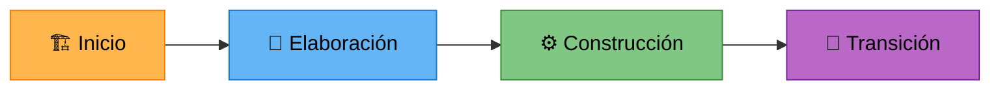

<p align="center">
  
  
  
  
  
  
</p>

# 🏛️ BPM Workflow System — Sistema de Gestión de Procesos de Negocio

Sistema empresarial de automatización de flujos de trabajo (BPM) con inteligencia artificial integrada. Construido bajo la metodología **PUDS (Proceso Unificado de Desarrollo de Software)** y una arquitectura estricta de **4 capas**.

## 🏗️ Estructura del Proyecto

```text
/bpm-workflow-system
├── /backend_bpm        # Spring Boot 4.0.5 REST API (JWT + Security)
│   ├── /app            # 🔵 Capa Aplicación (Controllers, DTOs, Security)
│   ├── /domain         # 🟢 Capa Dominio (Services, Lógica, Validaciones)
│   └── /data           # 🔴 Capa Datos (Entities, MongoDB Repositories)
│
├── /frontend-bpm       # Angular 20 SPA (Portal Administrativo)
│   └── /src/app
│       ├── /presentation # 🔵 Capa Presentación (Componentes UI)
│       └── /data         # 🟡 Capa Datos Frontend (Services, Models)
│
├── /Movil_bpm          # Flutter B2C App (Portal del Cliente)
│   └── /lib
│       ├── /core       # ⚙️ Red, Router, Tema Global
│       ├── /features   # 📦 Módulos: Auth, Tramites, Perfil
│       └── /shared     # 🧱 Widgets Reutilizables
│
├── /ia_microservice    # 🤖 FastAPI / IA
│   └── main.py         # Endpoints de IA (Python)
│
└── docker-compose.yml  # Infraestructura (MongoDB)
```

## 🔄 Metodología PUDS (Proceso Unificado de Desarrollo de Software)

El desarrollo sigue las fases iterativas e incrementales del PUDS:



| Fase PUDS | Ciclo del Proyecto | Estado |
|---|---|---|
| **Inicio + Elaboración** | Ciclo 1: Cimientos, Seguridad y Multiplataforma | ✅ Completado |
| **Elaboración + Construcción** | Ciclo 2: Motor Core, Builders y Dashboard Móvil B2C | ✅ Completado |
| **Construcción** | Ciclo 3: Formularios Dinámicos, Subida de Archivos y Trámites | 🚧 En Progreso |
| **Transición** | Ciclo 4: IA, Optimización y Lanzamiento | ⚠️ Pendiente |

### Artefactos PUDS Generados

- 📋 [Plan Operativo de Desarrollo](./PLAN_OPERATIVO_DE_DESARROLLO.md) — Roadmap completo de casos de uso
- 🧪 [Plan de Pruebas](./PLAN_PRUEBAS.md) — Pruebas unitarias, integración y verificación full-stack
- 📐 [Plan de Desarrollo Central](./PLAN_DESARROLLO_CENTRAL.md) — Visión arquitectónica del sistema
- 📱 [Instrucciones Móvil](./Movil_bpm/INSTRUCCIONES_MOVIL.md) — Roadmap específico de la App Flutter

---

## 🚀 Guía Rápida de Inicio

### Prerrequisitos

| Herramienta | Versión Mínima |
|---|---|
| Java JDK | 17+ |
| Node.js | 20+ |
| Flutter SDK | 3.24+ |
| Docker + Docker Compose | 24+ |
| Python | 3.11+ |

### 1. Levantar la Base de Datos

```bash
docker compose up -d
```

### 2. Levantar el Backend (Spring Boot)

```bash
cd backend_bpm
./mvnw spring-boot:run
```

### 3. Levantar el Frontend (Angular)

```bash
cd frontend-bpm
npm install && ng serve
```

### 4. Levantar la App Móvil (Flutter)

```bash
cd Movil_bpm
flutter pub get
flutter run
```

---

## 🔐 Seguridad Multiplataforma

El sistema utiliza un esquema de seguridad unificado basado en **JWT**:

- **Backend:** Centraliza la lógica de roles (ADMIN, FUNCIONARIO, CLIENTE).
- **Web:** Interceptors para inyección automática de tokens en el dashboard.
- **Móvil:** Almacenamiento cifrado con `flutter_secure_storage` y guards de navegación en `GoRouter`.
- **Registro:** Endpoint público para auto-registro de clientes externos.

---

## 📂 Navegación Rápida

| Módulo | Descripción | Enlace |
|---|---|---|
| 🖥️ **Backend** | API REST, Seguridad JWT y Auditoría | [→ Ver Backend](./backend_bpm/README.md) |
| 🌐 **Frontend Web** | Dashboard administrativo Angular | [→ Ver Frontend](./frontend-bpm/README.md) |
| 📱 **App Móvil** | Aplicación B2C Flutter para clientes | [→ Ver Móvil](./Movil_bpm/README.md) |
| 🤖 **Microservicio IA** | Motor de NLP y analítica FastAPI | [→ Ver carpeta IA](./ia_microservice/) |
| 📋 **Roadmap Móvil** | Progreso detallado de la App | [→ Ver Instrucciones](./Movil_bpm/INSTRUCCIONES_MOVIL.md) |

---

## 🧑‍💻 Equipo de Desarrollo

| Rol | Tecnología |
|---|---|
| Backend Engineer | Spring Boot 4.0.5 (Java 17) |
| Frontend Engineer | Angular 20 (TypeScript) |
| IA Engineer | FastAPI (Python) |
| DevOps | Docker Compose |

---

<p align="center">
  <sub>Proyecto académico — Ingeniería de Software I — 2026</sub>
</p>
